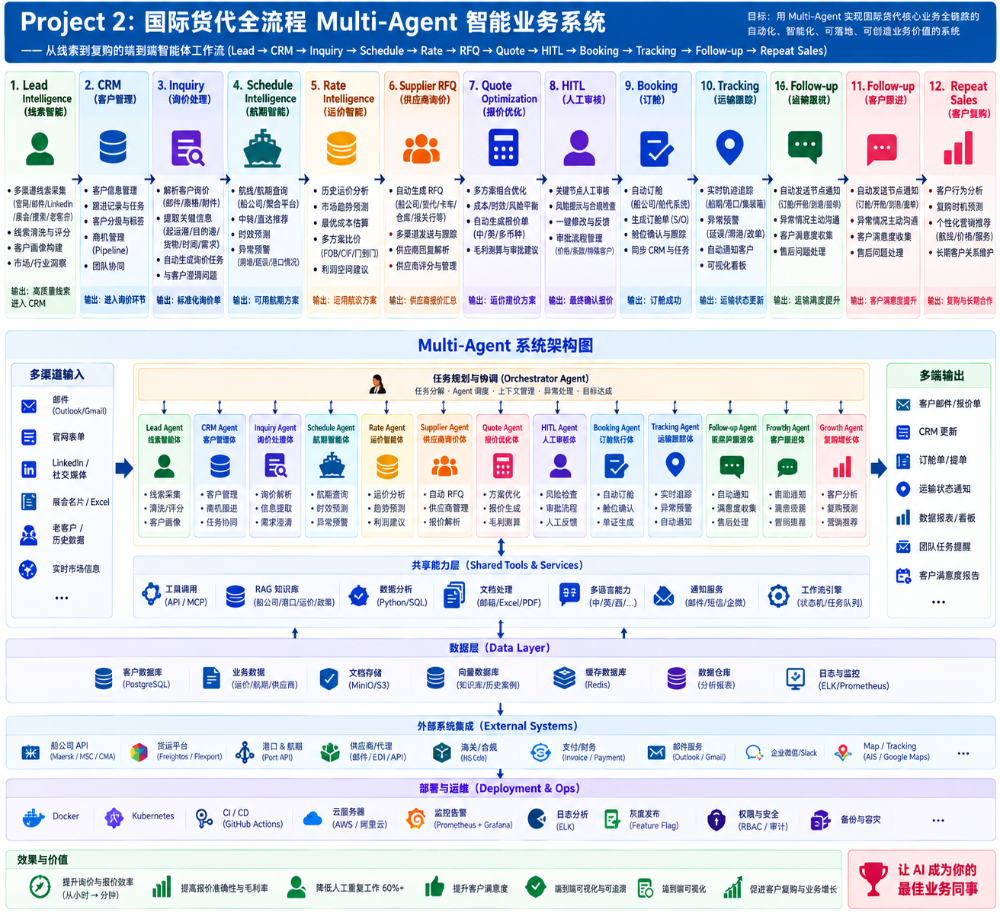

# AI Freight Forwarder — Multi-Agent Business Platform

> 国际货代销售全链路：**主动获客 → 询价 → 航线/运价 → 供应商 RFQ → 报价优化 → 人工审批 → 订舱 → 船位跟踪 → 复购跟进**

[](https://github.com/1536605949/ai-freight-forwarder-multi-agent/actions/workflows/ci.yml)

**这是一个生产级参考实现（Release Candidate），不是聊天机器人 Demo。**

它要回答的问题是：当 Agent 真正进入一门**有金额、有对外承诺、有合规责任**的生意时，
哪些部分可以交给模型，哪些部分**必须**交给确定性代码，以及这条界线在代码里长什么样。



---

## 一分钟验证

不需要 LLM Key、不需要任何外部账号、不需要数据库服务：

```bash
git clone https://github.com/1536605949/ai-freight-forwarder-multi-agent.git
cd ai-freight-forwarder-multi-agent
python scripts/bootstrap_dev.py          # 建 venv + 装依赖 + alembic upgrade head + 种子（幂等，可重复执行）
python -m uvicorn app.main:app --port 8100

# 另开一个终端：
pytest -q                                # 单元 + 集成：189 passed
python evaluation/run_eval.py            # 行为评测：6/6 通过
python scripts/delivery_check.py         # 交付验收：40/40 通过
sha256sum -c SHA256SUMS.txt              # 完整性校验：130/130 OK
```

打开 <http://localhost:8100/demo/overview.html>，点「运行完整流程」——
十步业务链路会一次跑通，**并在人工审批闸门处停下**。

### 当前实测状态

| 项目 | 结果 | 复现命令 |
|---|---|---|
| 单元 / 集成测试 | **189 passed** | `pytest -q` |
| 覆盖率 | **83%**（`app` + `worker` + `evaluation`） | `pytest --cov=app --cov=worker --cov=evaluation` |
| 静态检查 | **ruff 全绿**（规则集见 `pyproject.toml`） | `ruff check app tests worker evaluation scripts` |
| 行为评测 | **6/6**，全部真实执行 | `python evaluation/run_eval.py` |
| 交付验收 | **40/40** | `python scripts/delivery_check.py` |
| 完整性校验 | **130/130 OK** | `sha256sum -c SHA256SUMS.txt` |
| API 路由 | **43** | `GET /docs` |
| 数据表 / 索引 | **20 / 35** | `alembic upgrade head` |
| 模块循环依赖 | **0** | `tests/test_architecture_asset.py` |

> 上述数字都是本仓库当前代码实测所得，不是目标值。跑一遍即可复核。
> CI 逐步执行 lint / tests / packaging / checksums / manifest / migrations / smoke boot。

---

## 四条核心设计决策

整个工程的说服力集中在这四条上。每一条都有对应的代码位置和测试。

### 1. Agent 负责理解与生成；确定性代码负责金额、权限、状态、审批、发送

`app/services/pricing.py` 里没有 LLM 调用。供应商比价是 `supplier_score()` 的确定性函数，
报价是 `sell = cost + max(MINIMUM_MARGIN_USD, cost * DEFAULT_MARGIN_PCT)`。
Agent 只负责**生成给客户看的措辞**，提示词里明确写着「不得改变 Pricing Engine 数字」。

```python
# app/services/pricing.py —— 钱的算术不经过模型
best = min(quotes, key=supplier_score)
cost   = round(best.ocean_freight + best.surcharges, 2)
margin = round(max(s.minimum_margin_usd, cost * s.default_margin_pct), 2)
sell   = round(cost + margin, 2)
```

### 2. 门禁在服务层，不在编排层

`send_quote()` 自己检查审批状态，而不是依赖调用方记得检查：

```python
# app/services/approval.py
if q.status != 'approved':
    raise ValueError('approval_required')
```

这意味着**编排逻辑写错也越不过门禁**。`tests/test_orchestrator.py` 断言未审批时
流水线停在闸门、不产生任何面向客户的副作用。

### 3. 编排只排序，不授权

`app/services/orchestrator.py` 的十阶段流水线里，可逆的内部步骤（解析、查航线、查运价、发 RFQ、
收报价、比价）自动跑；一旦要**对外发信或花钱订舱**，立即停下并返回 `waiting_approval`。

```
parse → schedules → rates → rfq → supplier_quotes → optimize
      → ⟦hitl_review 闸门⟧ → ⟦quote_send 闸门⟧ → booking → vessel_tracking
```

恢复执行**复用同一条代码路径**（`start_stage='hitl_review'`），而不是另写一套 "continue" 实现——
两套实现一定会漂移。

### 4. 状态迁移显式化，且只进不退

`app/state_machine.py` 是状态的唯一真相来源。`app/enums.py` 只声明**有哪些状态**，
迁移图单独一个模块，因为「谁能接谁」是一条业务规则，不是词汇表。

```python
INQUIRY_TRANSITIONS = {
    READY:               {SCHEDULED, NEEDS_CLARIFICATION, CLOSED},
    SCHEDULED:           {WAITING_SUPPLIER_QUOTES, CLOSED},
    WAITING_SUPPLIER_QUOTES: {QUOTE_READY, WAITING_APPROVAL, CLOSED},
    WAITING_APPROVAL:    {APPROVED, REJECTED, CLOSED},
    APPROVED:            {SENT, CLOSED},
    SENT:                {BOOKED, CLOSED},
    BOOKED:              {CLOSED},
    CLOSED:              frozenset(),          # 唯一的汇点
}
```

`advance_status()` 幂等（重复投递是静默 no-op）且**只进不退**（回退一律报错）。

这条规则修掉了一个真实缺陷：`PATCH /api/v1/inquiries/{id}` 曾经会把已订舱（`booked`）的询价
**倒回** `ready`。现在终态询价的内容被冻结（返回 409 `inquiry_locked`），
在途询价改字段也不再动状态。

---

## 这个仓库最值得看的一点：门禁是**双层**的

如果只是「服务层有个 if」，那是单点防御。这里有意做成两层，并且**实测验证过**：

把 `send_quote()` 的审批检查注释掉（模拟有人改错），整个系统仍然拦住了这次发送：

```
FAIL hitl1      refusal did not cite approval_required:
                {'detail': 'illegal_status_transition: waiting_approval -> sent (quote.send)'}
5/6 passed; critical: 5/6 ok, 1 failed, 0 not executed
EXIT=1
```

第二层（状态机）发现询价想从 `waiting_approval` 直接跳到 `sent`，而中间少了 `approved` 这一步，
于是拒绝。**两层独立生效**，且评测脚本 `exit 1` 让 CI 失败。

`tests/test_eval_harness.py` 用注入式假客户端把这类变异固化成回归测试——
一个**不能失败**的评测脚本比没有评测脚本更危险，因为它制造虚假信心。

---

## 快速开始

### 一键（推荐）

```bash
python scripts/bootstrap_dev.py      # 幂等：检查 Python → 建 venv → 装依赖 → 建表 → 种子 → 自检
python -m uvicorn app.main:app --port 8100
```

常用参数：

```bash
python scripts/bootstrap_dev.py --check          # 只体检，不修改任何文件
python scripts/bootstrap_dev.py --skip-install   # venv 已就绪时跳过 pip
python scripts/bootstrap_dev.py --reset-db       # 重建数据库
```

### 手工等价步骤

```bash
python -m venv .venv
source .venv/bin/activate            # Windows: .venv\Scripts\activate
pip install -r requirements-dev.txt
cp .env.example .env                 # 默认值即可跑通，无需任何凭证
python -m alembic upgrade head       # 建表
python scripts/seed_demo.py
uvicorn app.main:app --reload --port 8100
```

打开 <http://localhost:8100/docs> 查看 OpenAPI，或运行：

```bash
python scripts/demo_scenario.py      # 脚本化演示
python scripts/acceptance.py         # 端到端冒烟
```

---

## 一键跑完整流程（Orchestrator）

```bash
# 1. 投递一封询价邮件（ETD 是必填项，缺失会停在 needs_clarification）
curl -X POST http://localhost:8100/api/v1/messages/inbound \
  -H 'X-Demo-User: demo' -H 'X-Demo-Tenant: tenant-demo' -H 'Content-Type: application/json' \
  -d '{"external_message_id":"m1","sender_email":"buyer@acme-import.com","subject":"quote",
       "body":"Need 1x40HQ Shanghai to Los Angeles, ETD 2026-09-25"}'

# 2. 一键跑到闸门（返回 status=waiting_approval 与 pending.quote_id）
curl -X POST http://localhost:8100/api/v1/orchestrate/run \
  -H 'X-Demo-User: demo' -H 'X-Demo-Tenant: tenant-demo' -H 'Content-Type: application/json' \
  -d '{"inquiry_id":"inq_xxx"}'

# 3. 人工审批后继续（需 reviewer 角色）
curl -X POST http://localhost:8100/api/v1/orchestrate/continue \
  -H 'X-Demo-User: demo' -H 'X-Demo-Tenant: tenant-demo' -H 'Content-Type: application/json' \
  -d '{"quote_id":"cq_xxx","vessel_name":"MAEU-VESSEL"}'
```

要点：

- **未审批时调用 `/continue` 不会绕过闸门**——它返回 `waiting_approval`，什么也不做。
- **重复运行安全**：不会重复开 RFQ，不会重复订舱。
- 只读快照 `GET /api/v1/orchestrate/status/{inquiry_id}` 返回当前卡在哪一步（`waiting_on`）。
- `auto_approve` 仅用于演示/测试，**必须显式传参**，不读环境变量——避免在生产配置里被误开。
- 每次运行返回逐步轨迹（阶段名 + 状态 + 产出物 id），前端无需理解业务即可渲染进度。

---

## 演示页面

仅在 `ENVIRONMENT != production` 时挂载，不属于业务 API 面。

| 页面 | 地址 | 内容 |
|---|---|---|
| 全流程总览 | `/demo/overview.html` | 十阶段流水线一键跑通，含人工闸门交互 |
| 主动获客 | `/demo/prospecting.html` | 搜客户 → 画像 → 开发信 → 三道合规门禁 |
| 最简询价 | `/demo/` | 提交一封询价邮件，看结构化结果 |

`tests/test_demo_contract.py` 会断言页面里的阶段元数据与 `orchestrator.STAGES` **逐字一致**——
前后端契约漂移会直接让测试失败，而不是等到演示当天白屏。

---

## 主动获客与合规

从「等客户上门」扩展为「主动找客户」：

```
ProspectingSource (可插拔)
   → Prospecting Agent  (按航线评估匹配度)
   → Enrichment Agent   (客户画像 + 决策人角色)
   → Cold Outreach Agent(生成开发信)
   → 人工审批 + 三道合规门禁
   → Lead → 进入询价报价流程
```

**三道代码级门禁**（`app/services/prospecting.py`，提示词无法绕过）：

1. 必须已记录人工批准
2. 必须有合法处理依据（`opt_in` / `legitimate_interest_reviewed`）
3. 未超过触达频率上限（默认 30 天内 2 次）

另支持 `POST /api/v1/outreach/opt-out` 一键退订，立即在候选池、Lead、未发出草稿三处生效。

> **数据来源合规**：中国大陆海关提单数据不对普通企业开放，仅可通过持牌数据商获取；
> AIS 船位为付费授权数据。仓库内 `MockProspectingSource` 与 mock AIS 均为**合成数据**，
> 仅供演示（`data_origin=mock_synthetic`）。生产接入须取得相应许可，不得爬取。

---

## 船舶位置与主动延误预警

```
VesselPositionProvider (AIS Adapter) → 位置快照落库 → 延误判定
                                        → 超阈值生成 FollowUpTask 主动通知客户
```

```bash
curl -X POST "http://localhost:8100/api/v1/vessels/MV%20EVER%20GIVEN/refresh?voyage=024E&booking_id=bkg_xxx"
curl "http://localhost:8100/api/v1/vessels/MV%20EVER%20GIVEN/history"
```

- 位置快照保存在 `vessel_positions`——**有历史才能判断延误是否在扩大**，单次查询只能回答「现在在哪」。
- 按 `booking_id` 去重：同一订舱的延误预警只生成一条未关闭任务，不会被轮询刷爆。
- 无订舱不预警（没有可通知的客户，不凭空猜）。
- 客户 `do_not_contact` 时抑制预警。
- 阈值 `VESSEL_DELAY_ALERT_HOURS`（默认 12 小时）。

---

## 切到真实 LLM

默认 `AGENT_PROVIDER=mock`：确定性 mock runtime，**无 Key 也能完整跑通业务状态机**。
这是刻意的——业务正确性不应该依赖模型是否可用。

```bash
pip install -r requirements-agent.txt      # agent-framework 是可选项，不在 requirements.txt 里
export AGENT_PROVIDER=maf_openai
export OPENAI_API_KEY=...
export OPENAI_CHAT_MODEL=...
```

`MockAgentRuntime` 与 `MicrosoftAgentFrameworkRuntime` 实现同一个 `AgentRuntime` 接口，
所以切换 provider 不会触碰业务层。

> `requirements.txt` **刻意不包含** `agent-framework`：把它塞进必装依赖会让 Docker 构建和
> 所有普通安装一起失败。`tests/test_packaging.py` 会守住这条不变量。

---

## 生产边界（诚实清单）

这一节比上面任何一节都重要。以下都是**已知**的，不是没想到。

### 必须替换才能上生产

| 项 | 现状 | 生产要求 |
|---|---|---|
| 所有 Provider | `Mock*Provider`，确定性合成数据 | 接入真实 Carrier / DCSA / 合约价 / AIS，并取得商业授权 |
| 认证 | `AUTH_MODE=dev` 信任 `X-Demo-*` 头 | 必须 `jwt` + 真实密钥；demo 头在 jwt 模式下已被忽略（有测试） |
| 数据库 | SQLite（演示）/ Postgres（compose） | Postgres + 连接池 + 备份策略 |
| 密钥 | `.env` 明文默认值 | 密钥管理服务 |

### 已知技术债

- `worker/scheduler.py` 的 `process_due()` **没有行级锁**（`SELECT ... FOR UPDATE SKIP LOCKED`）。
  多副本部署前必须补，否则同一任务会被处理两次。
- `RFQ.expires_at` 已写入但**未被读取**——RFQ 超时目前没有自动恢复。
- `OutboxEvent` 只写不读，尚无消费者。
- `app/agents/maf_workflows.py` 是**未接线的参考实现**（3 个 workflow 工厂，0 调用点）。
  模块顶部已标注 `NOT WIRED`，`tests/test_maf_workflows.py` 把这一状态固化为测试，
  避免它悄悄烂成「看起来能用」。
- `deployment/docker-compose.yml` 声明了 `redis`，但代码中 0 引用。
- 对**提示词注入**没有专门防御：当前设计把 LLM 输出限制在「生成措辞」，
  金额与状态不经过模型，但这不等于攻击面为零。
- `InquiryPatch` 用 `None` 表示「未提供」，因此**无法通过 PATCH 清空某个字段**（需传空字符串）。

完整的架构审查（含证据与修复优先级）见 [`docs/ARCHITECTURE_REVIEW.md`](docs/ARCHITECTURE_REVIEW.md)。

---

## 项目结构

```
app/
  main.py            43 条路由；鉴权、错误码映射、demo 页面挂载
  state_machine.py   InquiryStatus 迁移图 + advance_status()（唯一真相来源）
  enums.py           状态词汇表
  models.py          20 张表（全部带 tenant_id）
  schemas.py         Pydantic 输入契约
  config.py          45 个配置项（与 .env.example 逐项对齐，有测试守）
  auth.py            dev 头 / JWT 双模式 + require_role()
  services/          确定性业务层：inquiry / schedule / rates / rfq / pricing /
                     approval / booking / tracking / vessel / followup /
                     prospecting / orchestrator
  agents/            runtime（mock ↔ MAF 同接口）、specialists、prompts、maf_workflows
  providers/         rates / schedule / booking / tracking / email / prospecting / vessel
                     （Protocol + Mock 实现 + 真实厂商骨架）
worker/scheduler.py  跟进任务轮询（支持 --once 用于 cron）
evaluation/          行为评测：golden_dataset.jsonl + run_eval.py
migrations/          Alembic；0001_initial 是显式冻结快照
demo_client/         静态演示页
tests/               179 个测试
docs/                架构、分层、集成、交付、审查文档
```

### 分层依赖方向

```
main (HTTP)  →  services (确定性业务)  →  models / providers
                      ↑
              agents (LLM，可选)
```

`app/providers/*` 对 `models` / `services` 有 **0 反向依赖**——适配层可以被单独替换或测试。

---

## 关于迁移

`migrations/versions/0001_initial.py` 是一份**显式写出的 DDL 冻结快照**，不是
`Base.metadata.create_all()`。

这个区别是实质性的：如果迁移去 introspect 当前模型，那么**改一个模型就会悄悄改变同一个
revision 产出的 schema**——两个都升到 `0001_initial` 的库互相不一致，却都报告成功，
而原始 schema 已经无法从代码里恢复。显式写出就把它冻住了。

`tests/test_migrations.py` 守住真正重要的不变量：**空库升到 head 后的 schema 必须与 ORM 声明完全一致**
（表、列、可空性、主键、唯一约束），并且 `downgrade base` 不留残余、重复升降级结果可复现。

### 本地引导也走 alembic，不走 create_all

`scripts/bootstrap_dev.py` 建库时执行的是 `alembic upgrade head`，**不是** `Base.metadata.create_all()`。

这是一个真实踩过的坑：`create_all()` 会把表全部建出来，但**不会写 `alembic_version` 行**。
于是本地库看起来完全健康，而下一次 `alembic upgrade head`——也就是生产路径——会直接死在
`table agent_runs already exists`。根因是**schema 有两个真相来源**，而先漂移的那个永远是没被测的那个。

现在引导与生产走同一条代码路径；`tests/test_migrations.py` 用 AST 断言 `bootstrap_dev.py`
里不存在 `create_all` 调用，并断言它确实 shell out 到 `alembic upgrade head`。

老库（此前用 `create_all` 建的）会被明确识别并给出两条出路，而不是抛一句原始 alembic 报错：

```
ERROR: this database was created before alembic owned the schema
       (its tables exist but there is no alembic_version row)
HINT : If it holds nothing you need, rebuild it:
       `python scripts/bootstrap_dev.py --skip-install --reset-db`.
       Otherwise, having confirmed the schema is current, adopt it with `alembic stamp head`.
```

刻意**不**自动 stamp：只有操作者能判断那个 schema 是否真的等于 head，
自动 stamp 会把真实漂移悄悄掩盖过去。

---

## 文档索引

| 文档 | 内容 |
|---|---|
| [`docs/ARCHITECTURE_LAYERS.md`](docs/ARCHITECTURE_LAYERS.md) | 分层职责与硬门禁清单 |
| [`docs/ARCHITECTURE_REVIEW.md`](docs/ARCHITECTURE_REVIEW.md) | 架构审查：模块职责、依赖、数据流、薄弱环节与修复优先级 |
| [`docs/AGENT_DESIGN.md`](docs/AGENT_DESIGN.md) | Agent 边界与提示词策略 |
| [`docs/INTEGRATIONS.md`](docs/INTEGRATIONS.md) | 外部系统接入（含运价数据的硬约束） |
| [`docs/DELIVERY_STEP1.md`](docs/DELIVERY_STEP1.md) | 第一步交付状态与验收口径 |
| [`docs/PRODUCTION_GAPS.md`](docs/PRODUCTION_GAPS.md) | 距离生产还差什么 |
| [`docs/SECURITY.md`](docs/SECURITY.md) | 安全与合规边界 |
| [`HOW_TO_RUN.txt`](HOW_TO_RUN.txt) | 纯文本运行手册 |

---

## License

见 `LICENSE`。仓库内所有 Mock Provider 产出均为**合成数据**，不含任何真实客户、真实运价或个人信息。
