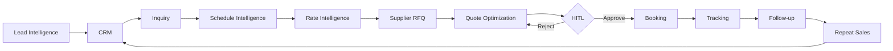
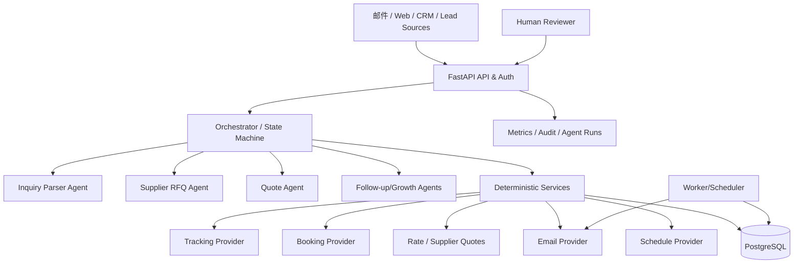

# 完整架构

## 业务飞轮

## 技术分层

### 为什么不是“所有模块都是 Agent”
- 价格公式、利润底线、状态机、权限、HITL、幂等：**确定性代码**。
- 解析非结构化消息、生成反问、写 RFQ、解释比价、生成报价文案、跟进文案：**Agent**。
- 船期/Track&Trace/Booking：**外部 API Provider**。
- 长时间等待：**DB 状态 + Worker + Webhook**。
